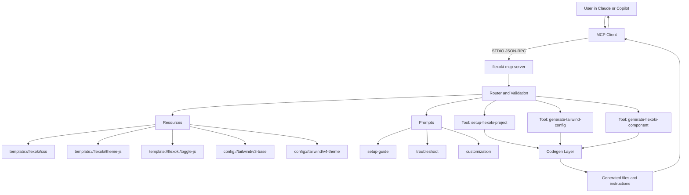

# Flexoki MCP Server

MCP server for generating and integrating Flexoki theme setup across web projects.

## What this server provides

- Tools:
  - `setup-flexoki-project`: Full project setup bundle for React, Next.js, Vue, or static HTML.
  - `generate-tailwind-config`: Tailwind v3 config or Tailwind v4 `@theme` config generation.
  - `generate-flexoki-component`: Framework-specific example component generation.
- Resources:
  - `template://flexoki/css`
  - `template://flexoki/theme-js`
  - `template://flexoki/toggle-js`
  - `config://tailwind/v3-base`
  - `config://tailwind/v4-theme`
- Prompts:
  - `setup-guide`
  - `troubleshoot`
  - `customization`

## Architecture Visualization



## Requirements

- Node.js 18+

## Local development

```bash
npm install
npm run build
npm run test
npm run dev
```

## VS Code configuration

Add server configuration to `.vscode/mcp.json` (workspace) or your user profile MCP config.

### Recommended: npm package via npx

```json
{
  "servers": {
    "flexoki": {
      "type": "stdio",
      "command": "npx",
      "args": ["-y", "@raghav-56/flexoki-mcp-server"]
    }
  }
}
```

### Alternative: local checkout

Build first:

```bash
npm install
npm run build
```

Then configure VS Code:

```json
{
  "servers": {
    "flexoki": {
      "type": "stdio",
      "command": "node",
      "args": ["${workspaceFolder}/dist/index.js"]
    }
  }
}
```

If your repository is nested (for example, `workspace/flexoki-mcp-server`), adjust the path accordingly (for example, `${workspaceFolder}/flexoki-mcp-server/dist/index.js`).

When tools or prompts change, run `MCP: Reset Cached Tools` in VS Code.

## Claude Desktop configuration

### Recommended: Global Installation

Install the server globally:

```bash
npm install -g @raghav-56/flexoki-mcp-server
```

Then add this to your `claude_desktop_config.json`:

```json
{
  "mcpServers": {
    "flexoki": {
      "command": "flexoki-mcp-server",
      "type": "stdio"
    }
  }
}
```

### Alternative: Local Installation

If you prefer a project-specific installation, clone the repository and build it locally:

```bash
git clone <repo-url>
cd flexoki-mcp-server
npm install
npm run build
```

Then add this to your `claude_desktop_config.json` (replace the path):

```json
{
  "mcpServers": {
    "flexoki": {
      "command": "node",
      "args": ["/absolute/path/to/flexoki-mcp-server/dist/index.js"],
      "type": "stdio"
    }
  }
}
```

## Publish to npm

```bash
npm run build
npm test
npm publish --access public
```

## Example interactions

- "Set up Flexoki for my Next.js app using Tailwind v4."
- "Generate a Tailwind v3 config using flexoki-theme.js."
- "Generate a Vue card component with Flexoki semantic tokens."
